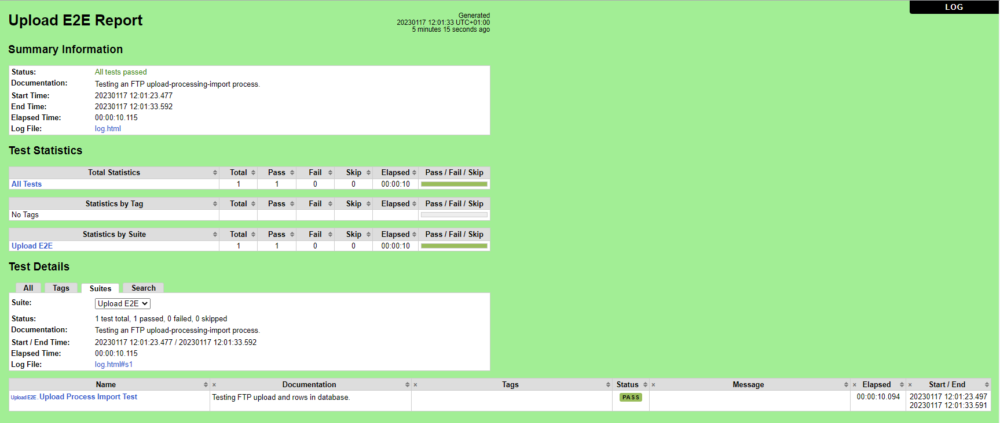
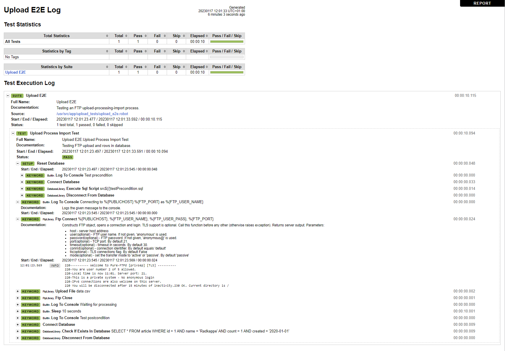

# Article - Testing Upload-Import Processes

A common business process consists of uploading a file to an FTP server. Then the file is processed in some way and its content is imported into a database. How could such process be tested and monitored? The following describes an approach to test and monitor such a process using the [Robot Framework](https://robotframework.org/).

## The Business Process

The business process consists of the following steps.

1. An external entity uploads a file to the FTP server. The external entity might be a human user or some service.
2. The processing service monitoring the FTP server for new files reads the file content.
3. The processing service optionally processes the file content in some way.
4. The processing service writes the file content to the database.
5. The processing service deletes the file from the FTP server.

As shown, three services participate in this process.

- FTP service
- Processing service
- Database service

These services might be implemented as separate server machines, VMs or containerized services. To test and monitor the process, we would need a fourth service. In this article, a Robot Framework test case will be created to implement the monitor.

## The Test Case

Generally, a test case follows the well-known AAA pattern: arrange, act, assert. In other words, it has the following three logical steps.

1. Setup (Precondition / Fixture)
2. One or more action steps
3. Expected result (Postcondition)

In our case here, to test the upload-import process, we need the following concrete steps.

1. Setup
   - Clean up old test data from the database.
2. Action steps
   - Upload test data file to FTP server.
   - Wait some time for processing.
3. Expected result
   - Check that the test data file content was written to the database.

Note: you should always try to avoid waiting for time in test cases and use other mechanisms such as hooks or messaging to be notified when a dependee has finished his work. However, to keep things simple, we will simply wait for some time here.

Let us see how Robot Framework can help us with this test case.

## Introducing Robot Framework

Robot Framework is a generic framework for robotic process automation (RPA) and test automation. Specifically, keyword-driven testing. It uses plain text files and a tabular format to describe test cases with keywords implemented in external libraries. Most libraries are implemented in Python, but the use of other programming languages is possible as well.

To get an impression what test cases in Robot Framework look like, let us have a look at a quite simple generic test case.

    *** Settings ***
    Documentation    Some useful test suite documentation here.
    Library          SomeExternalLibrary
    Test Setup       Keyword For Setup                                 # Arrange
    
    *** Test Cases ***
    My First Test
        [Documentation]   Some useful test case documentation here.
    
        Keyword For Action One    Keyword    Parameters                # Act
        Keyword For Action Two    Other    Keyword    Parameters       # Act
    
        Keyword To Check Expected Result                               # Assert

You can easily recognize the AAA pattern. I use the test setup in the settings section for the arrange step. But there are other options as well. See [Test setup and teardown](https://robotframework.org/robotframework/latest/RobotFrameworkUserGuide.html#test-setup-and-teardown) in the documentation.

I use the space separated format, where two or more spaces separate pieces of the data, such as keywords and their arguments. So, in the example above, `Keyword For Action One` is parsed as one token because the words are separated only by one space. But `Keyword` and `Parameters` are parsed as two tokens because they are separated by more than two spaces. For other formats see [Supported file formats](https://robotframework.org/robotframework/latest/RobotFrameworkUserGuide.html#supported-file-formats) in the documentation.

Let us have a look at the test case for our business process as we would write it for Robot Framework.

    *** Settings ***
    Documentation    Testing an FTP upload-processing-import process.
    Library          FtpLibrary
    Library          DatabaseLibrary
    Test Setup       Reset Database
    
    *** Test Cases ***
    Upload Process Import Test
        [Documentation]    Testing FTP upload and rows in database.
    
        Log To Console    Connecting to %{PUBLICHOST}:%{FTP_PORT} as %{FTP_USER_NAME}
        Ftp Connect       %{PUBLICHOST}    %{FTP_USER_NAME}    %{FTP_USER_PASS}    %{FTP_PORT}
        Upload File       data.csv
        Ftp Close
    
        Log To Console    Waiting for processing
        Sleep             10 seconds
    
        Log To Console                 Test postcondition
        Connect Database
        Check if exists in database    SELECT * FROM article WHERE id = 1 AND name = 'Radkappe' AND count = 1 AND created = '2020-01-01'
        Disconnect From Database

First, in the test setup, we reset the database and delete existing old test data. Then, we upload a file to the FTP server and wait for the file to be processed. Finally, we assert that the content of the file we have uploaded to the FTP server has been written to the database.

## Robot Framework Features

Now, we will have a look at some Robot Framework features. You create test cases in test case files with extension `.robot`. A test case file automatically creates a test suite. For example, say you create a test case file `my_tests.robot`. This will create a test suite `My tests`. See [Creating test suites](https://robotframework.org/robotframework/latest/RobotFrameworkUserGuide.html#creating-test-suites) in the documentation.

As you can see, the test case file is very readable. Let us have a look at the different sections.

It starts with a settings section, where you can add some documentation, import external libraries, and define a test setup that is run before each test case in the suite. The test case uses two external libraries. DatabaseLibrary to access the database server and FtpLibrary to access the FTP server. See [Using test libraries](https://robotframework.org/robotframework/latest/RobotFrameworkUserGuide.html#using-test-libraries) in the documentation.

After the settings section follows the test cases section. Each test case starts with a name and is followed by keywords. As already explained, keywords for a test case are indented by spaces and arguments to keywords are separated by spaces. Four spaces are recommended. Keywords come either from an external library or you can implement them yourself.

Creating keywords for yourself is quite easy. They are created in a separate keywords section that follows the test cases section. This test case uses the keyword "Connect Database". Here is the definition of this keyword.

    *** Keywords ***
    Connect Database
        Log To Console         Connecting to %{PGHOST}:%{PGPORT}, DB %{PGDATABASE} as %{PGUSER}
        Connect To Database    psycopg2    %{PGDATABASE}    %{PGUSER}    %{PGPASSWORD}    %{PGHOST}    %{PGPORT}

See [Creating user keywords](https://robotframework.org/robotframework/latest/RobotFrameworkUserGuide.html#creating-user-keywords) in the documentation.

You might have noticed the special syntax to access environment variables like `%{PGHOST}`. This will retrieve the value of the environment variable with name `PGHOST`. See [Variables](https://robotframework.org/robotframework/latest/RobotFrameworkUserGuide.html#variables) in the documentation.

This list of features is by no means complete. I just gave you some examples to wheaten your appetite. Have a look at the extensive documentation to see what other features are available. It is recommended to start with the [User Guide](https://robotframework.org/robotframework/latest/RobotFrameworkUserGuide.html).

## Using Gherkin with Behavior-driven Development (BDD)

Robot Framework also supports writing test cases in behavior-driven development style using the [Gherkin language](https://cucumber.io/docs/gherkin/). Gherkin is supported out-of-the-box. No additional plugins or libraries are necessary to use this style. Robot Framework simply drops the first word when searching for matching keywords. So, we could rewrite our existing test case to get a BDD scenario as follows.

    When Log To Console    Connecting to %{PUBLICHOST}:%{FTP_PORT} as %{FTP_USER_NAME}
    And Ftp Connect    %{PUBLICHOST}    %{FTP_USER_NAME}    %{FTP_USER_PASS}    %{FTP_PORT}
    And Upload File    data.csv
    And Ftp Close
    And Log To Console    Waiting for processing
    And Sleep    10 seconds
    
    Then Log To Console    Test postcondition
    And Connect Database
    And Check if exists in database    SELECT * FROM article WHERE id = 1 AND name = 'Radkappe' AND count = 1 AND created = '2020-01-01'
    And Disconnect From Database

See [Different test case styles](http://robotframework.org/robotframework/latest/RobotFrameworkUserGuide.html#different-test-case-styles) in the documentation.

Note: I added just the Gherkin keywords `When`, `Then`, `And` in front of the keywords to illustrate how keyword resolution works in this case. If you would like to use BDD scenarios for your testing, I strongly recommend using user defined keywords to make the scenarios more readable.

## Reporting

When you execute the test cases, a nice HTML report is produced in the directory you set with the command line option `--outputdir`. The following shows how to execute the test case file `upload_e2e.robot` in a bash terminal.

    # robot --outputdir ./log ./upload_tests/upload_e2e.robot
    ==============================================================================
    Upload E2E :: Testing an FTP upload-processing-import process.                
    ==============================================================================
    Upload Process Import Test :: Testing FTP upload and rows in datab... Test precondition
    .Connecting to robot-db:5432, DB robotdb as robotusr
    ...Connecting to robot-ftp:21 as bob
    ....Waiting for processing
    Upload Process Import Test :: Testing FTP upload and rows in datab... ..Test postcondition
    .Connecting to robot-db:5432, DB robotdb as robotusr
    Upload Process Import Test :: Testing FTP upload and rows in datab... | PASS |
    ------------------------------------------------------------------------------
    Upload E2E :: Testing an FTP upload-processing-import process.        | PASS |
    1 test, 1 passed, 0 failed
    ==============================================================================
    Output:  /usr/src/app/log/output.xml
    Log:     /usr/src/app/log/log.html
    Report:  /usr/src/app/log/report.html
    # 

Open file `report.html` to see the report. You will see some summary information, test statistics and test details.

You can drill down into the test case details by opening the log file `log.html`.

As you can see, there is a lot of information to help you analyze your test execution results.

## Try It Yourself

If you want to try this solution, you'll find a repository on [GitHub](https://github.com/mneiferbag/robot-ftp-db) with a [README.md](https://github.com/mneiferbag/robot-ftp-db/blob/main/README.md) that has a description about using Docker to simulate this solution.

To have a simple, self-contained example that is easy to try for yourself, the readme file describes how to use Docker Compose to set up containers for all four services. This example uses Pure-FTPd as FTP service, PostgreSQL as database service and a simple Python script to simulate a processing service.

Finally, to turn the test suite into a monitor, you could set up a cron job or task for your favorite CI/CD tool like Jenkins, which then runs the test suite at given time intervals.

I hope you now have an impression about a possible solution to test upload-import processes and how Robot Framework could help you with this task. Please let me know what you think about this solution.
